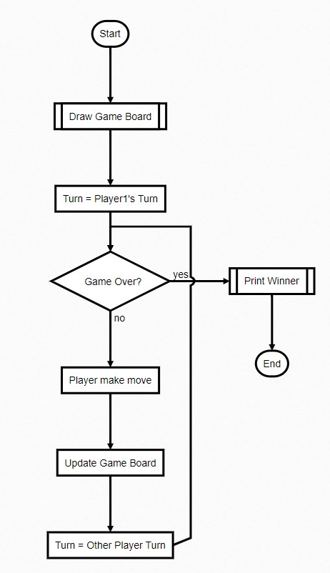

# Lesson 3: Build a Tic-Tac-Toe Game

## Analysis the flow of the game


## Create board
```
def init_board(w, h):
    b = []
    for y in range(0, h):
        b.append([])
        for x in range(0, w):
            b[y].append(0)
    return b
```

## Draw board
```
def print_board(board):
    for y in range(0, 3):
        line = ''
        for x in range(0, 3):
            if board[x][y] == 0:
                line = line + '-'
            elif board[x][y] == 1:
                line = line + 'X'
            elif board[x][y] == 2:
                line = line + 'O'
        print(line)
```

## Player Move
```
def player1_move(board, x, y):
    board[x][y] = 1

def player2_move(board, x, y):
    board[x][y] = 2
```
## Get Player Input
```
def input_player_move(player_number):
    x = input("Player {0}, enter your move X:".format(player_number))
    y = input("Player {0}, enter your move Y:".format(player_number))
    return int(x), int(y)
```

## Game Over?
Condition 1: Somebody won
```
def who_won(board):
    # 0 means no one win, 1 means player 1 wins, 2 means player 2 wins
    result = 0
    # check row
    for y in range(0, 3):
        result = check_winning(board[0][y], board[1][y], board[2][y])
        if result > 0:
            return result
    # check col
    for x in range(0, 3):
        result = check_winning(board[x][0], board[x][1], board[x][2])
        if result > 0:
            return result
    # check diagonal:
    result = check_winning(board[0][0], board[1][1], board[2][2])
    if result > 0:
        return result
    result = check_winning(board[2][0], board[1][1], board[0][2])
    if result > 0:
        return result
    return 0


def check_winning(a, b, c):
    if (a == 1) and (b == 1) and (c == 1):
        return 1
    elif (a == 2) and (b == 2) and (c == 2):
        return 2
    else:
        return 0
```
Condition 2: Game board is full
```
def is_full(board):
    result = True
    for y in range(0, 3):
        for x in range(0, 3):
            if board[x][y] == 0:
                result = False
                break
    return result
```

## Overall Flow
```
def main():
    board = init_board()
    won = 0
    turn = 1
    while (won == 0) and (is_full(board) is False):
        print_board(board)
        print_line()
        x, y = input_player_move(turn)
        if turn == 1:
            player1_move(board, x, y)
        if turn == 2:
            player2_move(board, x, y)
        won = who_won(board)
        if turn == 1:
            turn = 2
        else:
            turn = 1
    print_board(board)
    print_line()
    if won > 0:
        print("Player {0} has won!!".format(won))
    else:
        print("It is a tie.")
```


