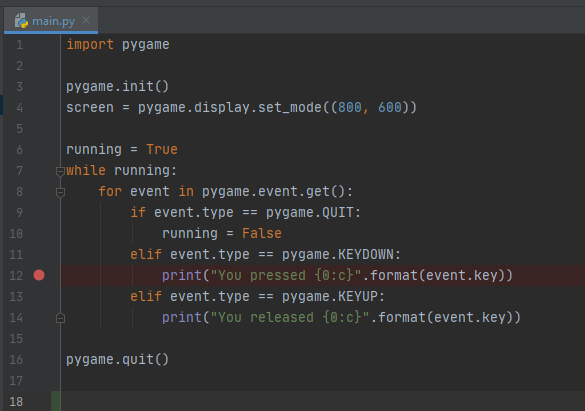
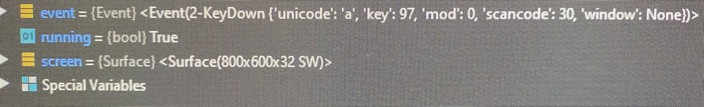

# Lesson 6 - Beginning PyGame

## Installation of PyGame Library

1. Go to Terminal (from bottom of the PyCharm)
```commandline
Microsoft Windows [Version 10.0.18362.778]
(c) 2019 Microsoft Corporation. All rights reserved.

(env) D:\Projects\github\pygame-class>
```

2. Install PyGame library
```commandline
pip install pygame
```

## Test PyGame

Create a new directory "lesson6" and create a file "main.py" under it.

```
import pygame

pygame.init()
screen = pygame.display.set_mode((800, 600))

running = True
while running:
    for event in pygame.event.get():
        if event.type == pygame.QUIT:
            running = False

pygame.quit()
```

## PyGame Events
```
import pygame

pygame.init()
screen = pygame.display.set_mode((800, 600))

running = True
while running:
    for event in pygame.event.get():
        if event.type == pygame.QUIT:
            running = False
        elif event.type == pygame.KEYDOWN:
            print("You pressed {0:c}".format(event.key))
        elif event.type == pygame.KEYUP:
            print("You released {0:c}".format(event.key))

pygame.quit()

```

|Event Type   | Parameters  | 
|-------------|-------------|
|QUIT | None  | 
|KEYDOWN| unicode, key, mod|
|KEYUP| key, mod|

## Homework

Modify the program in "PyGame Events" to response to "q" key, so that user can quite by pressing "q" button.

Before, you make changes to the program, you need to find out how to detect "q" key

Step 1: Set a break point and observe what is in an "event".



Step 2: Click debug button (The button next to run).  Press some key (like 'a', 'b' ... and 'q').  This picture
shows when you press letter 'a'



The value for the __event.key__ is actually 97 for letter 'a'.

Step 3:  After you figure out what value is letter 'q', you can modify the program to check if __event.key__
represent 'q', and then you can change the variable "running" to False

